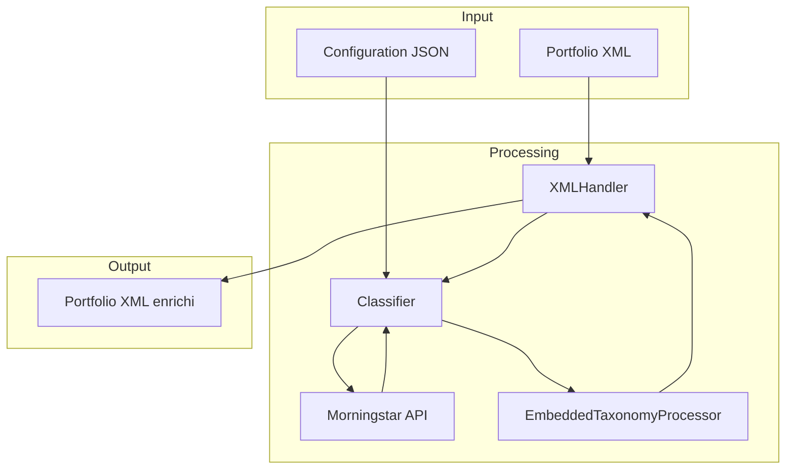
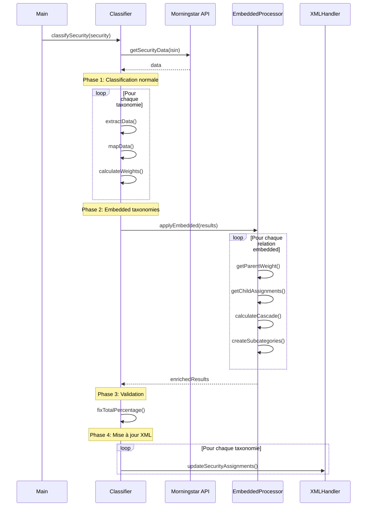

# Architecture technique : Taxonomies Imbriquées

## 🏗️ Vue d'ensemble du système



## 🔄 Flux de traitement détaillé



## 📦 Structure des données

### Configuration

```typescript
interface EmbeddedTaxonomyConfig {
  active: boolean;
  parentTaxonomy: string; // "asset_type"
  parentCategory: string; // "Stock"
  childTaxonomy: string; // "stock_style"
  targetTaxonomy: string; // "asset_type"
}
```

### Résultats intermédiaires

```typescript
interface TaxonomyAssignment {
  path: string[]; // ["Stock", "Large Growth"]
  weight: number; // 5600 (56%)
}

interface TaxonomyResult {
  taxonomyId: string; // "asset_type"
  assignments: TaxonomyAssignment[];
}

// Map stockant tous les résultats
Map<string, TaxonomyResult>;
```

### Exemple de données

```typescript
// Avant embedded
{
  "asset_type": {
    taxonomyId: "asset_type",
    assignments: [
      { path: ["Stock"], weight: 8000 },
      { path: ["Bond"], weight: 2000 }
    ]
  },
  "stock_style": {
    taxonomyId: "stock_style",
    assignments: [
      { path: ["Large Growth"], weight: 7000 },
      { path: ["Small Value"], weight: 3000 }
    ]
  }
}

// Après embedded
{
  "asset_type": {
    taxonomyId: "asset_type",
    assignments: [
      { path: ["Stock", "Large Growth"], weight: 5600 },
      { path: ["Stock", "Small Value"], weight: 2400 },
      { path: ["Bond"], weight: 2000 }
    ]
  },
  "stock_style": {
    taxonomyId: "stock_style",
    assignments: [
      { path: ["Large Growth"], weight: 7000 },
      { path: ["Small Value"], weight: 3000 }
    ]
  }
}
```

## 🧮 Algorithme de calcul

### Pseudo-code principal

```typescript
function applyEmbeddedTaxonomies(
  results: Map<string, TaxonomyResult>,
  configs: EmbeddedTaxonomyConfig[],
): Map<string, TaxonomyResult> {
  for (const config of configs) {
    if (!config.active) continue;

    // 1. Récupérer les résultats
    const parentResult = results.get(config.parentTaxonomy);
    const childResult = results.get(config.childTaxonomy);
    const targetResult = results.get(config.targetTaxonomy);

    if (!parentResult || !childResult || !targetResult) continue;

    // 2. Trouver la pondération parent
    const parentWeight = findCategoryWeight(parentResult.assignments, config.parentCategory);

    if (parentWeight === 0) continue;

    // 3. Créer les assignments imbriqués
    const embeddedAssignments = childResult.assignments.map((child) => ({
      path: [config.parentCategory, ...child.path],
      weight: Math.round((parentWeight * child.weight) / 10000),
    }));

    // 4. Remplacer dans le résultat cible
    targetResult.assignments = targetResult.assignments.filter((a) => !pathEquals(a.path, [config.parentCategory]));

    targetResult.assignments.push(...embeddedAssignments);
  }

  return results;
}
```

### Fonction de recherche de pondération

```typescript
function findCategoryWeight(assignments: TaxonomyAssignment[], category: string): number {
  const assignment = assignments.find((a) => a.path.length === 1 && a.path[0] === category);
  return assignment ? assignment.weight : 0;
}
```

### Fonction de comparaison de chemins

```typescript
function pathEquals(path1: string[], path2: string[]): boolean {
  if (path1.length !== path2.length) return false;
  return path1.every((segment, i) => segment === path2[i]);
}
```

## 🔍 Cas particuliers et gestion d'erreurs

### 1. Catégorie parent absente

```typescript
// Si Stock n'existe pas dans asset_type
const parentWeight = findCategoryWeight(assignments, "Stock");
if (parentWeight === 0) {
  console.log("Parent category not found, skipping embedded taxonomy");
  continue;
}
```

### 2. Taxonomie enfant sans données

```typescript
const childResult = results.get(config.childTaxonomy);
if (!childResult || childResult.assignments.length === 0) {
  console.log("Child taxonomy has no data, keeping parent as-is");
  continue;
}
```

### 3. Total > 100%

```typescript
// Après application des embedded taxonomies
for (const [taxonomyId, result] of results.entries()) {
  const total = result.assignments.reduce((sum, a) => sum + a.weight, 0);
  if (total > 10000) {
    result.assignments = fixTotalPercentage(result.assignments, taxonomyId);
  }
}
```

### 4. Arrondis

```typescript
// Utiliser Math.round pour éviter les décimales
const weight = Math.round((parentWeight * childWeight) / 10000);

// Exemple:
// parentWeight = 8000 (80%)
// childWeight = 7000 (70%)
// weight = Math.round((8000 * 7000) / 10000) = 5600 (56%)
```

## 🧪 Tests unitaires

### Test 1 : Calcul simple

```typescript
test("should calculate cascading weights correctly", () => {
  const parentWeight = 8000; // 80%
  const childWeight = 7000; // 70%
  const expected = 5600; // 56%

  const result = Math.round((parentWeight * childWeight) / 10000);
  expect(result).toBe(expected);
});
```

### Test 2 : Multiples enfants

```typescript
test("should handle multiple child assignments", () => {
  const parentWeight = 8000; // 80%
  const childAssignments = [
    { path: ["Large Growth"], weight: 7000 },
    { path: ["Small Value"], weight: 3000 },
  ];

  const results = childAssignments.map((child) => ({
    path: ["Stock", ...child.path],
    weight: Math.round((parentWeight * child.weight) / 10000),
  }));

  expect(results).toEqual([
    { path: ["Stock", "Large Growth"], weight: 5600 },
    { path: ["Stock", "Small Value"], weight: 2400 },
  ]);

  const total = results.reduce((sum, r) => sum + r.weight, 0);
  expect(total).toBe(8000); // 80%
});
```

### Test 3 : Parent absent

```typescript
test("should skip when parent category is missing", () => {
  const assignments = [{ path: ["Bond"], weight: 10000 }];

  const parentWeight = findCategoryWeight(assignments, "Stock");
  expect(parentWeight).toBe(0);

  // L'embedded taxonomy ne doit pas être appliquée
});
```

### Test 4 : Validation du total

```typescript
test("should maintain 100% total after embedding", () => {
  const results = new Map([
    [
      "asset_type",
      {
        taxonomyId: "asset_type",
        assignments: [
          { path: ["Stock", "Large Growth"], weight: 5600 },
          { path: ["Stock", "Small Value"], weight: 2400 },
          { path: ["Bond"], weight: 2000 },
        ],
      },
    ],
  ]);

  const total = results.get("asset_type")!.assignments.reduce((sum, a) => sum + a.weight, 0);

  expect(total).toBe(10000); // 100%
});
```

## 📊 Métriques de performance

### Complexité algorithmique

- **Temps :** O(n × m) où n = nombre de taxonomies, m = nombre d'embedded configs
- **Espace :** O(n × k) où k = nombre moyen d'assignments par taxonomie

### Optimisations possibles

1. **Cache des pondérations parent** : Éviter de recalculer plusieurs fois
2. **Traitement parallèle** : Si plusieurs embedded configs indépendantes
3. **Validation lazy** : Ne valider le total que si nécessaire

## 🔐 Validation et sécurité

### Validation de la configuration

```typescript
function validateEmbeddedConfig(config: EmbeddedTaxonomyConfig): boolean {
  // 1. Vérifier que les taxonomies existent
  if (!taxonomiesConfig[config.parentTaxonomy]) {
    console.error(`Parent taxonomy '${config.parentTaxonomy}' not found`);
    return false;
  }

  if (!taxonomiesConfig[config.childTaxonomy]) {
    console.error(`Child taxonomy '${config.childTaxonomy}' not found`);
    return false;
  }

  // 2. Vérifier que targetTaxonomy existe
  if (!taxonomiesConfig[config.targetTaxonomy]) {
    console.error(`Target taxonomy '${config.targetTaxonomy}' not found`);
    return false;
  }

  // 3. Vérifier qu'il n'y a pas de cycle
  if (config.childTaxonomy === config.targetTaxonomy) {
    console.warn(`Potential circular reference detected`);
  }

  return true;
}
```

### Détection de cycles (futur)

```typescript
// Pour éviter les références circulaires dans les versions futures
function detectCycles(configs: EmbeddedTaxonomyConfig[]): boolean {
  const graph = new Map<string, string[]>();

  for (const config of configs) {
    if (!graph.has(config.parentTaxonomy)) {
      graph.set(config.parentTaxonomy, []);
    }
    graph.get(config.parentTaxonomy)!.push(config.childTaxonomy);
  }

  // Algorithme de détection de cycles (DFS)
  // ...

  return false; // Pas de cycle détecté
}
```

## 🚀 Évolutions futures

### Phase 2 : Embedding récursif

```typescript
// Permettre plusieurs niveaux d'imbrication
{
  "embeddedTaxonomies": {
    "sector_in_stock": {
      "parentTaxonomy": "asset_type",
      "parentCategory": "Stock",
      "childTaxonomy": "stock_sector",
      "targetTaxonomy": "asset_type"
    },
    "industry_in_sector": {
      "parentTaxonomy": "asset_type",
      "parentCategory": "Stock > Technology",
      "childTaxonomy": "industry",
      "targetTaxonomy": "asset_type"
    }
  }
}
```

### Phase 3 : Conditions d'application

```typescript
interface EmbeddedTaxonomyConfig {
  // ...
  condition?: {
    minWeight?: number; // Appliquer seulement si parent > X%
    maxWeight?: number; // Appliquer seulement si parent < X%
  };
}
```

### Phase 4 : Mapping contextuel

```typescript
interface EmbeddedTaxonomyConfig {
  // ...
  categoryMapping?: Record<string, string>;
  // Ex: "Large Growth" → "Growth" dans le contexte de Stock
}
```

## 📈 Monitoring et logs

### Logs recommandés

```typescript
console.log(`[Embedded] Processing '${config.childTaxonomy}' into '${config.parentCategory}'`);
console.log(`[Embedded] Parent weight: ${parentWeight / 100}%`);
console.log(`[Embedded] Created ${embeddedAssignments.length} subcategories`);
console.log(`[Embedded] Total weight: ${total / 100}%`);
```

### Métriques à tracker

- Nombre d'embedded taxonomies appliquées
- Temps de traitement par embedded taxonomy
- Nombre d'ajustements de pondération nécessaires
- Nombre de cas où l'embedding n'a pas pu être appliqué

## 🎯 Points d'attention

1. **Ordre de traitement** : Traiter les embedded configs dans l'ordre de définition
2. **Immutabilité** : Ne pas modifier les résultats originaux des taxonomies enfants
3. **Validation** : Toujours valider que le total fait 100% après embedding
4. **Logs** : Logger suffisamment pour débugger facilement
5. **Rétrocompatibilité** : Embedded désactivé par défaut
