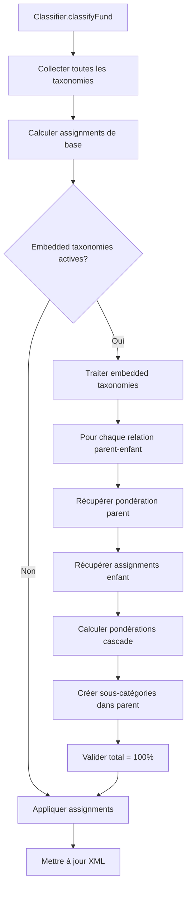

# Plan d'implémentation : Taxonomies Imbriquées (Embedded)

## 🎯 Objectif

Implémenter un système de taxonomies imbriquées permettant de rattacher une taxonomie à une catégorie spécifique d'une autre taxonomie, avec calcul automatique des pondérations en cascade.

## 📋 Cas d'usage

### Exemple 1 : Stock Style imbriqué dans Asset Type

**Données source :**

- Asset Type : 80% Stock, 20% Bond
- Stock Style : 70% Large Growth, 30% Small Value

**Résultat attendu dans la taxonomie Asset Type :**

```
Asset Type
├── Stock (80%)
│   ├── Large Growth (56%)  ← 80% × 70%
│   └── Small Value (24%)   ← 80% × 30%
└── Bond (20%)
```

### Exemple 2 : Bond Sector imbriqué dans Asset Type

**Données source :**

- Asset Type : 80% Stock, 20% Bond
- Bond Sector : 60% Government, 40% Corporate

**Résultat attendu dans la taxonomie Asset Type :**

```
Asset Type
├── Stock (80%)
└── Bond (20%)
    ├── Government (12%)    ← 20% × 60%
    └── Corporate (8%)      ← 20% × 40%
```

## 🏗️ Architecture proposée

### 1. Structure de configuration

Créer une nouvelle section `embeddedTaxonomies` dans la configuration :

```json
{
  "embeddedTaxonomies": {
    "stock_style_in_asset": {
      "active": true,
      "parentTaxonomy": "asset_type",
      "parentCategory": "Stock",
      "childTaxonomy": "stock_style",
      "targetTaxonomy": "asset_type"
    },
    "bond_sector_in_asset": {
      "active": true,
      "parentTaxonomy": "asset_type",
      "parentCategory": "Bond",
      "childTaxonomy": "bond_sector",
      "targetTaxonomy": "asset_type"
    }
  }
}
```

**Champs :**

- `active` : Active/désactive cette relation
- `parentTaxonomy` : ID de la taxonomie parent (ex: "asset_type")
- `parentCategory` : Nom de la catégorie parent où imbriquer (ex: "Stock")
- `childTaxonomy` : ID de la taxonomie enfant à imbriquer (ex: "stock_style")
- `targetTaxonomy` : ID de la taxonomie où créer les sous-catégories (généralement = parentTaxonomy)

### 2. Modèle de données TypeScript

Ajouter dans [`src/types.ts`](src/types.ts):

```typescript
export interface EmbeddedTaxonomyConfig {
  active: boolean;
  parentTaxonomy: string;
  parentCategory: string;
  childTaxonomy: string;
  targetTaxonomy: string;
}

export interface TaxonomyAssignment {
  path: string[];
  weight: number;
}

export interface TaxonomyResult {
  taxonomyId: string;
  assignments: TaxonomyAssignment[];
}
```

### 3. Flux de traitement



### 4. Algorithme de calcul des pondérations

```typescript
function applyEmbeddedTaxonomies(
  securityResults: Map<string, TaxonomyResult>,
  embeddedConfigs: EmbeddedTaxonomyConfig[],
): Map<string, TaxonomyResult> {
  for (const config of embeddedConfigs) {
    if (!config.active) continue;

    // 1. Récupérer les résultats des taxonomies parent et enfant
    const parentResult = securityResults.get(config.parentTaxonomy);
    const childResult = securityResults.get(config.childTaxonomy);

    if (!parentResult || !childResult) continue;

    // 2. Trouver la pondération de la catégorie parent
    const parentWeight = findCategoryWeight(parentResult.assignments, config.parentCategory);

    if (parentWeight === 0) continue;

    // 3. Calculer les nouvelles pondérations pour les sous-catégories
    const embeddedAssignments = childResult.assignments.map((childAssignment) => ({
      path: [config.parentCategory, ...childAssignment.path],
      weight: Math.round((parentWeight * childAssignment.weight) / 10000),
    }));

    // 4. Mettre à jour le résultat de la taxonomie cible
    const targetResult = securityResults.get(config.targetTaxonomy);

    // Retirer l'assignment parent original
    targetResult.assignments = targetResult.assignments.filter((a) => !pathEquals(a.path, [config.parentCategory]));

    // Ajouter les nouveaux assignments imbriqués
    targetResult.assignments.push(...embeddedAssignments);
  }

  return securityResults;
}
```

## 📝 Modifications des fichiers

### 1. [`src/types.ts`](src/types.ts:1)

- Ajouter `EmbeddedTaxonomyConfig` interface
- Ajouter `TaxonomyAssignment` interface
- Ajouter `TaxonomyResult` interface

### 2. [`src/classifier.ts`](src/classifier.ts:1)

**Modifications principales :**

1. Ajouter une propriété pour stocker les configurations embedded :

```typescript
private embeddedTaxonomiesConfig: Record<string, EmbeddedTaxonomyConfig>;
```

2. Modifier [`classifyFund()`](src/classifier.ts:98) pour :
   - Collecter tous les résultats de taxonomies dans une Map
   - Appeler `applyEmbeddedTaxonomies()` avant de mettre à jour le XML
   - Appliquer les assignments finaux

3. Créer une nouvelle méthode `applyEmbeddedTaxonomies()` :

```typescript
private applyEmbeddedTaxonomies(
  securityResults: Map<string, TaxonomyResult>
): Map<string, TaxonomyResult>
```

4. Créer des méthodes utilitaires :

```typescript
private findCategoryWeight(assignments: TaxonomyAssignment[], category: string): number
private pathEquals(path1: string[], path2: string[]): boolean
```

### 3. [`src/xml-helper.ts`](src/xml-helper.ts:1)

**Aucune modification majeure nécessaire** - La méthode [`ensureClassificationPath()`](src/xml-helper.ts:200) supporte déjà les chemins multi-niveaux !

### 4. [`config/default.json`](config/default.json:1)

Ajouter la section `embeddedTaxonomies` :

```json
{
  "embeddedTaxonomies": {
    "stock_style_in_asset": {
      "active": false,
      "parentTaxonomy": "asset_type",
      "parentCategory": "Stock",
      "childTaxonomy": "stock_style",
      "targetTaxonomy": "asset_type"
    },
    "bond_sector_in_asset": {
      "active": false,
      "parentTaxonomy": "asset_type",
      "parentCategory": "Bond",
      "childTaxonomy": "bond_sector",
      "targetTaxonomy": "asset_type"
    }
  }
}
```

### 5. Tests

Créer [`test/embedded-taxonomies.test.ts`](test/embedded-taxonomies.test.ts) :

```typescript
describe("Embedded Taxonomies", () => {
  test("should calculate cascading weights correctly", () => {
    // Fonds : 80% Stock, 20% Bond
    // Stock Style : 70% Large Growth, 30% Small Value
    // Résultat attendu :
    // - Stock > Large Growth : 56%
    // - Stock > Small Value : 24%
    // - Bond : 20%
  });

  test("should handle multiple embedded taxonomies", () => {
    // Tester avec stock_style ET bond_sector imbriqués
  });

  test("should maintain 100% total weight", () => {
    // Vérifier que la somme fait toujours 100%
  });

  test("should handle missing parent category gracefully", () => {
    // Si pas de Stock dans asset_type, stock_style ne doit pas être appliqué
  });
});
```

## 🔍 Cas particuliers à gérer

### 1. Catégorie parent absente

Si un fonds n'a pas de Stock (0%), alors `stock_style` ne doit pas être appliqué.

**Solution :** Vérifier `parentWeight > 0` avant de traiter.

### 2. Total > 100%

Avec les arrondis, le total pourrait dépasser 100%.

**Solution :** Réutiliser la logique [`fixTotalPercentage()`](src/classifier.ts:206) existante.

### 3. Taxonomies enfant manquantes

Si `stock_style` n'a pas de données pour un fonds.

**Solution :** Garder l'assignment parent original (Stock : 80%).

### 4. Chemins multi-niveaux existants

Si `asset_type` a déjà des chemins comme `["Stock", "US"]`, il faut éviter les conflits.

**Solution :** Vérifier que la catégorie parent n'a pas déjà d'enfants avant d'appliquer l'embedding.

### 5. Ordre de traitement

Si plusieurs embedded taxonomies ciblent la même taxonomie parent.

**Solution :** Traiter dans l'ordre de définition dans la config.

## 📊 Validation et tests

### Tests unitaires

1. **Calcul de pondération simple**
   - Input : Parent 80%, Child 70%
   - Output : 56%

2. **Multiples sous-catégories**
   - Input : Parent 80%, Children [70%, 30%]
   - Output : [56%, 24%]

3. **Arrondis**
   - Input : Parent 33%, Child 33.33%
   - Output : Vérifier que le total reste cohérent

4. **Catégorie parent = 0%**
   - Input : Parent 0%, Child 100%
   - Output : Aucun assignment créé

### Tests d'intégration

1. **Fonds multi-actifs réel**
   - Utiliser un fonds avec 60% Stock, 30% Bond, 10% Cash
   - Vérifier les pondérations finales

2. **Fonds 100% actions**
   - Vérifier que stock_style s'applique correctement

3. **Fonds 100% obligations**
   - Vérifier que bond_sector s'applique correctement

## 📚 Documentation à mettre à jour

### 1. [`readme.md`](readme.md:1)

Ajouter une section "Embedded Taxonomies" :

````markdown
### Embedded Taxonomies

You can nest taxonomies within specific categories of other taxonomies.
For example, embed Stock Style within the Stock category of Asset Type.

**Configuration example:**

```json
{
  "embeddedTaxonomies": {
    "stock_style_in_asset": {
      "active": true,
      "parentTaxonomy": "asset_type",
      "parentCategory": "Stock",
      "childTaxonomy": "stock_style",
      "targetTaxonomy": "asset_type"
    }
  }
}
```
````

**Result:** A fund with 80% Stocks (70% Large Growth, 30% Small Value)
will show:

- Stock > Large Growth: 56%
- Stock > Small Value: 24%

```

### 2. Créer [`docs/embedded-taxonomies.md`](docs/embedded-taxonomies.md)

Documentation détaillée avec :
- Concept et cas d'usage
- Configuration complète
- Exemples de résultats
- Diagrammes

## 🎨 Améliorations futures (hors scope)

1. **Embedding récursif** : Permettre d'imbriquer sur plusieurs niveaux
   - Ex: Asset Type > Stock > Sector > Industry

2. **Conditions d'application** : Appliquer l'embedding seulement si certaines conditions sont remplies
   - Ex: Seulement si Stock > 50%

3. **Mapping personnalisé** : Permettre de mapper différemment selon le parent
   - Ex: "Large Growth" → "Growth" dans le contexte de Stock

4. **Visualisation** : Créer un diagramme de la structure finale dans les logs

## ✅ Critères de succès

1. ✅ Un fonds 80% Stock / 20% Bond avec stock_style 70% Large Growth / 30% Small Value produit :
   - Stock > Large Growth : 56%
   - Stock > Small Value : 24%
   - Bond : 20%

2. ✅ Le total des pondérations fait toujours 100%

3. ✅ Les taxonomies non-embedded continuent de fonctionner normalement

4. ✅ La configuration est rétrocompatible (embedded désactivé par défaut)

5. ✅ Les tests passent tous

6. ✅ La documentation est complète et claire

## 🚀 Plan d'implémentation par étapes

### Phase 1 : Fondations (2-3h)
- [ ] Créer les interfaces TypeScript
- [ ] Ajouter la section config dans default.json
- [ ] Créer les tests unitaires de base

### Phase 2 : Logique core (3-4h)
- [ ] Implémenter `applyEmbeddedTaxonomies()`
- [ ] Implémenter les méthodes utilitaires
- [ ] Modifier `classifyFund()` pour collecter les résultats

### Phase 3 : Intégration (2-3h)
- [ ] Intégrer dans le flux de classification
- [ ] Gérer les cas particuliers
- [ ] Valider avec fixTotalPercentage

### Phase 4 : Tests et validation (2-3h)
- [ ] Tests d'intégration complets
- [ ] Tests avec données réelles
- [ ] Correction des bugs

### Phase 5 : Documentation (1-2h)
- [ ] Mettre à jour readme.md
- [ ] Créer docs/embedded-taxonomies.md
- [ ] Ajouter des exemples de configuration

---

**Estimation totale : 10-15 heures de développement**
```
