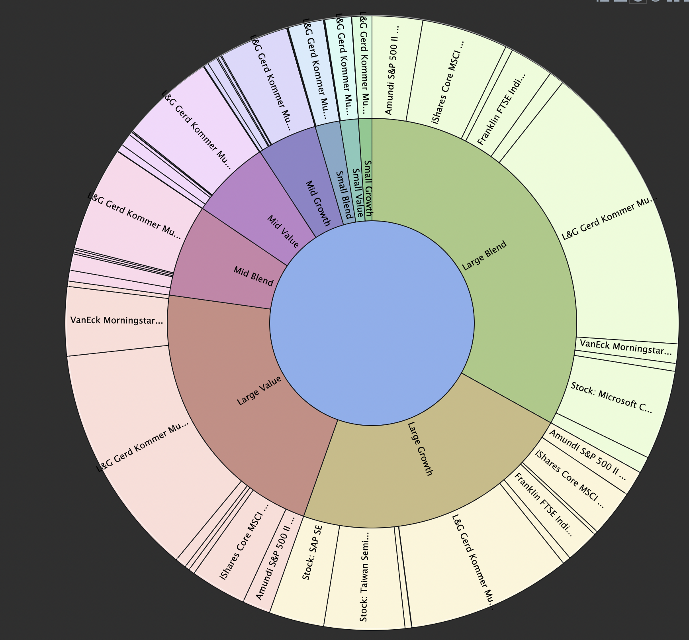
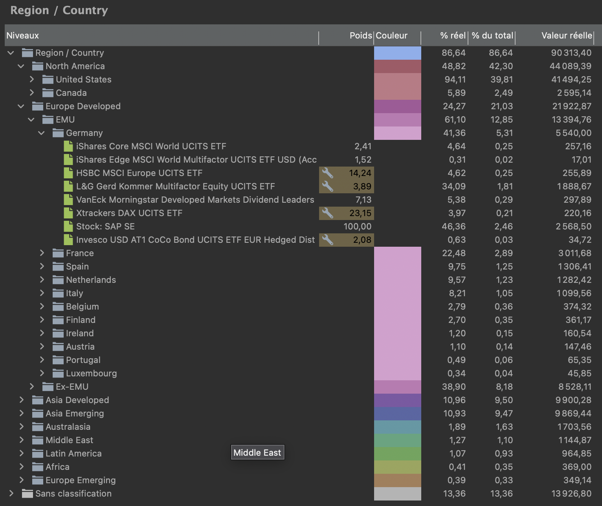
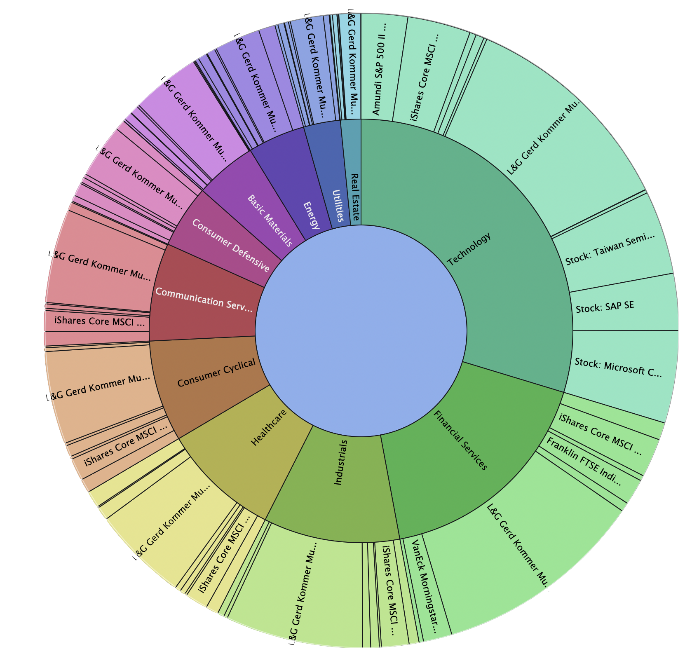
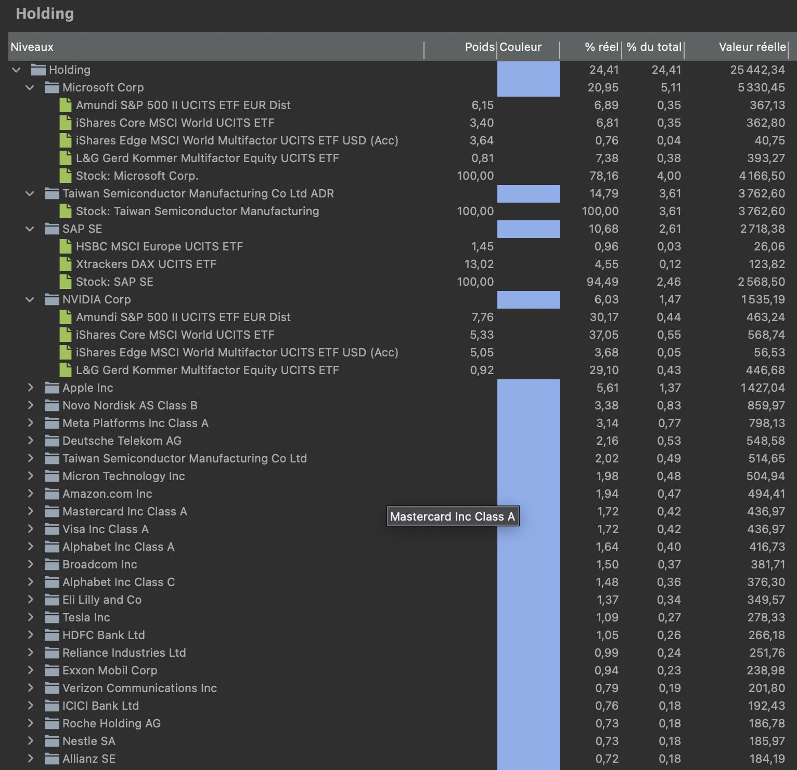

# Portfolio Performance Classifier (TypeScript)

This project is an automation tool for [Portfolio Performance](https://www.portfolio-performance.info/). It automatically classifies your securities (Funds, ETFs, Stocks) by retrieving data from Morningstar.

It is a **TypeScript** adaptation and rewrite of the Python project [Alfons1Qto12/pp-portfolio-classifier](https://github.com/Alfons1Qto12/pp-portfolio-classifier), offering better maintainability, strong typing, and configuration flexibility.

## Features

- **Multi-Type Support**: Handles Funds/ETFs as well as Stocks (via Morningstar SAL API).
- **Automatic Taxonomies**: Creates and updates classifications in your XML file:
  - Asset Allocation (Equity, Bond, Cash, etc.)
  - Regions (Americas, Europe, Asia, etc.)
  - Sectors (Technology, Healthcare, Finance, etc.)
- **Non-destructive**: Generates a new XML file by default to avoid overwriting your data without verification.
- **Configurable**: Customize the script's behavior (language, taxonomies, etc.) via a configuration file.
- **Multi-levels taxonomies**: Supports nested taxonomies (e.g., "Europe > Germany").

## How it works

1. **Parsing**: The script reads your `.xml` file and extracts all securities with a valid ISIN.
2. **Data Retrieval**: It queries Morningstar APIs to fetch:
   - **Asset Allocation**: Breakdown by asset type (Cash, Stocks, Bonds, etc.).
   - **World Regions**: Geographical breakdown (Americas, Europe, Asia, etc.).
   - **Sectors**: Industry breakdown (Technology, Healthcare, Energy, etc.).
3. **Classification**: It maps the retrieved data to the taxonomies defined in your configuration.
4. **Generation**: A new XML file is generated containing your original data plus the new classification categories and assignments.

## Prerequisites

- [Node.js](https://nodejs.org/) (v22 or higher recommended)
- yarn or npm

## Installation

1. `git clone` this repository.
2. Install dependencies:

```bash
yarn
```

## Configuration

The project uses `node-config` for configuration management.

### Customization (Language and Taxonomies)

You can customize the script's behavior (change the taxonomy language, modify the Morningstar domain, etc.) by creating a `config/local.json` file. This file will override the default values ​​defined in `config/default.json`.

This is ideal for adapting category names to your language or personal preferences.

**Example of `config/local.json`:**

```json
{
  "mappings": {
    "AssetTypeMap": {
      "1": ["Actions"],
      "3": "Obligations",
      "5": ["Obligations", "Hybrides", "Préférentielles"],
      "6": ["Obligations", "Hybrides", "Convertibles"],
      "7": "Liquidités & équivalents",
      "8": "Autres",
      "99": "Autres"
    }
  },
  "taxonomies": {
    "asset_type": {
      "name": "Classes d’actifs",
      "stockConfig": {
        "value": ["Actions"]
      }
    },
    "country_by_region": { "name": "Zones économiques" },
    "sector": { "active": true },
    "region": {
      "active": false
    },
    "country": {
      "active": false
    },
    "holding": {
      "active": false
    }
  }
}
```

## Usage

To run the classification on your portfolio file:

```bash
yarn start -- <path_to_your_portfolio.xml> [output_path.xml]

```

- **Input** - The path to your current Portfolio Performance `.xml` file.

- **Output** (Optional): The path to save the modified file. Default: input file with suffix `.classified.xml`.

## Troubleshooting

- **Missing Data**: If a security is not classified, it might be because Morningstar does not have data for that specific ISIN, or the ISIN is missing in your Portfolio Performance file.
- **Rate Limiting**: If you have a very large portfolio, Morningstar might temporarily block requests. The script includes delays to mitigate this.
- **Invalid XML**: Ensure your input file is a valid Portfolio Performance XML file (unencrypted).

## Warning

Although this script takes care not to corrupt XML files, **always back up your Portfolio Performance file** before using it.

## Gallery

### Autoclassified stock-style



### Autoclassified Regions



### Autoclassified Sectors



### List of stocks and holdings from Top 10 of each fund



## Credits

Based on the original work by Alfons1Qto12.
